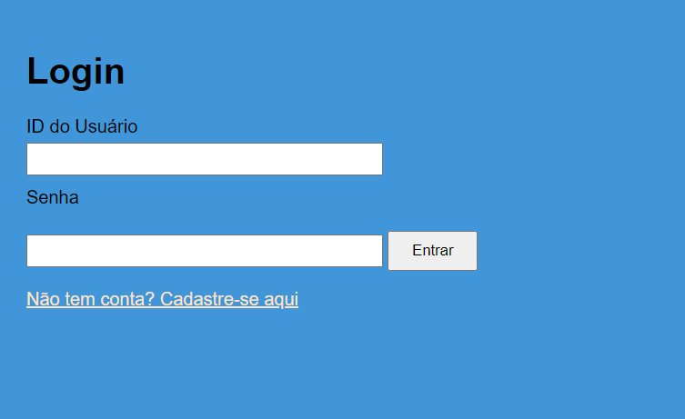

# Sistema de Inscrição - Programa Trilhas

## O que é o projeto

Este projeto é um aprimoramento do sistema de inscrição do programa de formação tecnológica do Governo do Estado do Maranhão, realizado por meio da Secretaria de Estado da Ciência, Tecnologia e Inovação (SECTI-MA) em parceria com a Fundação de Amparo à Pesquisa e ao Desenvolvimento Científico e Tecnológico do Maranhão (FAPEMA). O sistema permite que os candidatos realizem suas inscrições de forma prática e segura, além de oferecer funcionalidades como validação de dados e armazenamento local.

## Demos
Você pode acessar as páginas publicadas em: <https://rhsousa.github.io/trilhasDesafio3>
ou usar o qr-code para vizualizar no celular


- forms de [cadastro](https://rhsousa.github.io/trilhasDesafio3/forms.html)
- pagina de [login](https://rhsousa.github.io/trilhasDesafio3/login.html)

----
----

## Como rodar localmente

1. Clone o repositório para sua máquina local:
   ```bash
   git clone https://github.com/Rhsousa/trilhasDesafio3.git
    ```
2. Navegue até o diretório do projeto:

    ```bash
    cd trilhasDesafio3
    ```

3. Abra o arquivo `forms.html` ou `login.html` diretamente no navegador para visualizar o sistema.

4. Certifique-se de que o navegador utilizado suporta o uso de **localStorage** em html aperto diratamente, para o correto funcionamento das funcionalidades de salvamento de dados. Ou então será necesario servir o projeto. Recomendo usar a extensão Live Server no vsCode


## Tecnologias utilizadas

- HTML5: Estruturação das páginas e formulários.
- CSS3: Estilização e layout das páginas.
- Vanila (JavaScript): Validação de formulários, manipulação de eventos e armazenamento de dados no localStorage.


## páginas

- Cadastro


- Login


